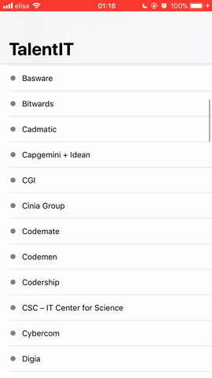
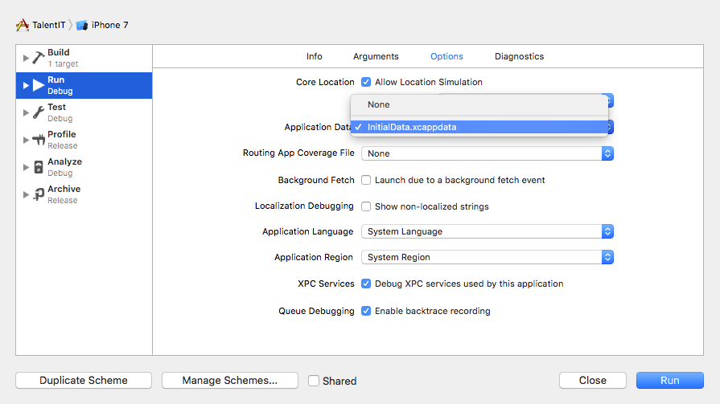

# TalentIT Career Fair

TalentIT Career Fair app to quickly save positive/neutral/negative feedbacks from companies. Next time you get back home from such fair you will remember which companies you should contact and which not.

## Compiling Suggestions

If you want a pre-populated CoreData database follow these two steps.

1. Launch the app while holding the Option key: `⌥+⌘+R` (Option-Command-R).
2. A scheme configuration sheet will appear.
In the Options tab, select `InitialData.xcappdata` from the Application Data menu and click "Run".

## Coming Soon

* Ability to add companies (automatically sorted in alphabetical order)
* Alphabetical side-selection in `TableView`
* Note field to write meaningful informations about the company
* Pre-loaded companies (so you don't have to prompt them manually)
