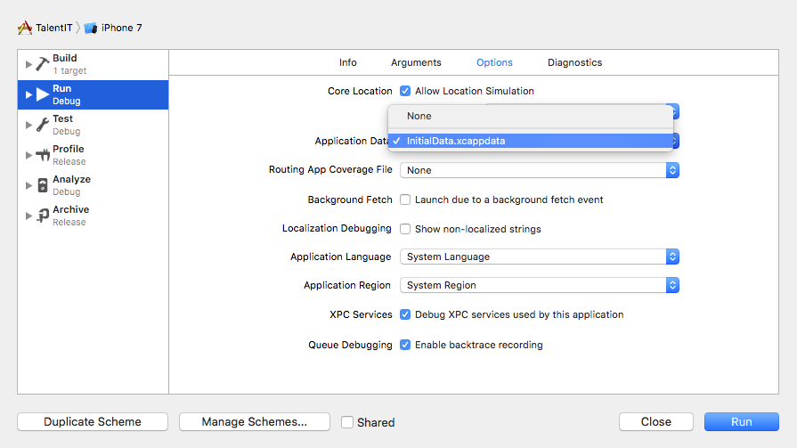

# TalentIT Career Fair

TalentIT Career Fair app to quickly save positive/neutral/negative feedbacks from companies. Next time you get back home from such fair you will remember which companies you should contact and which not.

## Compile suggestions

1. Launch the app while holding the Option key: `⌥+⌘+R` (Option-Command-R).
2. A scheme configuration sheet will appear.
In the Options tab, select `InitialData.xcappdata` from the Application Data menu and click "Run".

## Coming Soon

* Note field to add meaningful informations about the company
